# Week 0 — Billing and Architecture


## Required Tasks

### Recreate Conceptual Diagram in Lucid Charts or on a Napkin

I recreated the conceptual diagram for the cruddur app. A conceptual diagram helps to define concepts and rules for a project and there's no technical aspect to it. Here's an image showing the conceptual diagram I recreated:

*Conceptual Diagram: [View on Lucid](https://lucid.app/lucidchart/75c603ed-0af5-406f-9a48-b45606ba87a0/edit?viewport_loc=-387%2C-238%2C3968%2C2263%2C0_0&invitationId=inv_3fc1bff0-46f8-427e-b9eb-7e9c61da4289)*


### Recreate Logical Architectual Diagram in Lucid Charts

I also recreated the logical diagram (i.e the blue print) for the cruddur app. The logical diagram defines how the system should be implemented, 
breaking the large conceptual diagram into functional logical blocks.

*Logical Diagram: [View on Lucid](https://lucid.app/lucidchart/9f493397-c7dd-4bb1-bf5d-d8103beb5a64/edit?viewport_loc=-521%2C-73%2C3842%2C2191%2C0_0&invitationId=inv_18573649-5770-4a56-9a09-d01998f68b58)*


### AWS Billing
From the Billing dashboard, on the billing preference page, I selected options to receive PDF version of my AWS invoice and also to receive 
free tier usage alerts and billing alerts via my email address. Also took a general overview of the billing dashaboard to know how to check 
cost incurred break down by service and all other billing related options on the dashboard. I also explored cost management on AWS using 
AWS Cost Explorer, which is a helpful service to get cost and usage reports of resources on your AWS account and alos good for auditing.

*Billing Preference Page*


*AWS Cost Explore Page*


### Create a Budget
I created a new budget to track my credits spend. There was already a budget created on my AWS account to track monthly spend and it was set
to $10. This was created during a course I attended for my AWS Developer Associate certification. The new budget was specifically created to 
track my credits spend even though I do not currently have any credits on my AWS account and the threshold was set to $1. I also created an 
alert for notification, which will be triggered when 100% forecasted spending equals the threshoald of 1%. As for the free tier, you can only 
create maximum of 2 budegts, additional budgets will incur cost.

*Screenshot images from the task:*


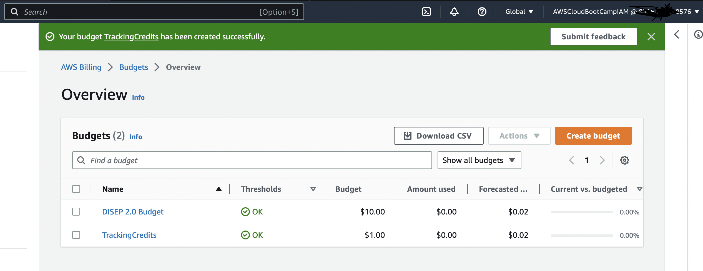


### Add MFA to Root account
I created my AWS account months before this bootcamp so I have already carried out the security recommendations required to secure my account. However, for this bootcamp I created a new IAM user and for which I have also set Multi-factor Authentication. MFA serves as another layer of security to protect our resources on AWS. The security recommendation from the attached screenshots have already been attended to and there are no affected policy but it wouldn't just disappear lol.

*Screenshot images from the task:*

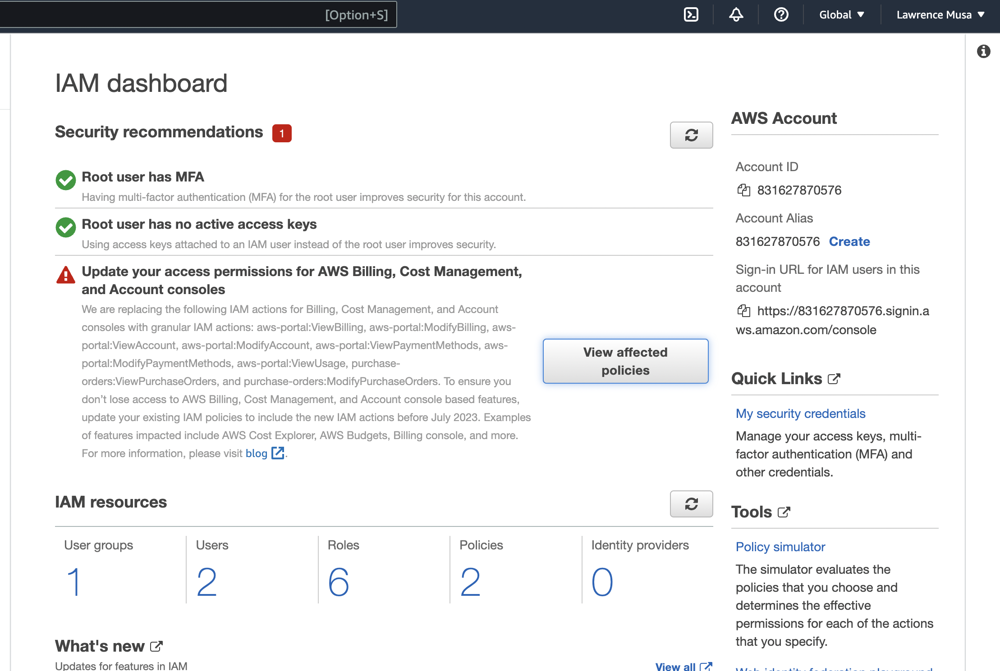

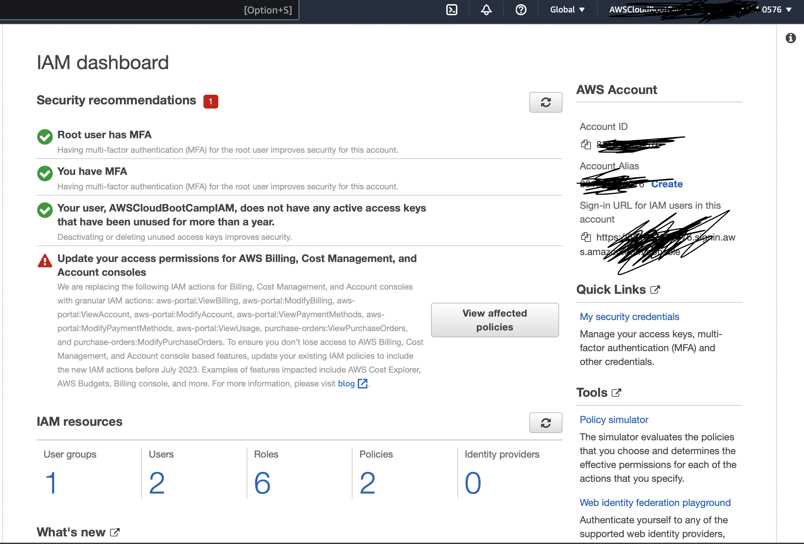


### Generate AWS Credentials
I generated access keys and downloaded the .csv file on my computer and securely saved. This access keys will give my user permission to access resources on my AWS account from the CLI (Command Line Interface).

*Screenshot images from the task:*

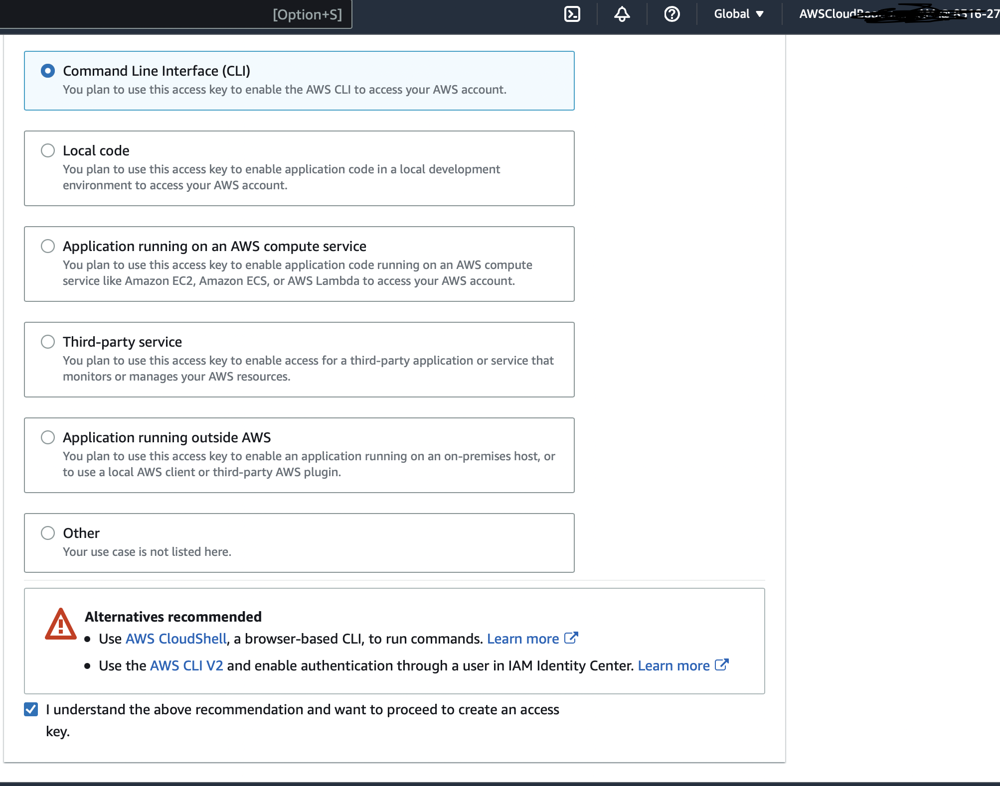

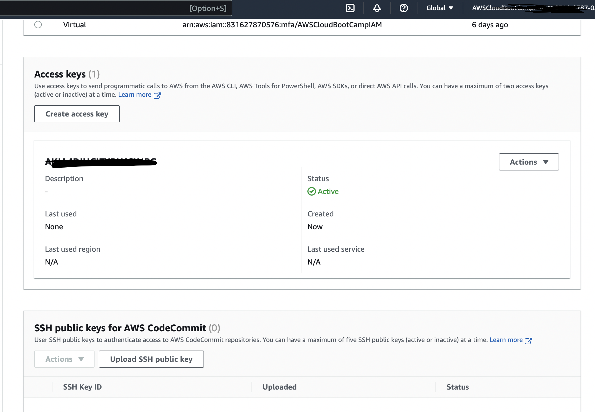


### Use CloudShell
I launched AWS CloudShell from the console in the us-east-1 region. AWS CloudShell is a preconfigured command line interface to securely access your resources on AWS and it is recommended over third-party CLIs. 

I configured the CloudShell auto prompt feature which is not enabled by the default by running the code below in the provided environment

```
aws --cli-auto-prompt
```
Using the AWS STS CLI commands below I was able to get information about the current user.

```
aws sts get-caller-identity
```

Also I run the command below to show contact information of the user.

```
aws account get-contact-information
```

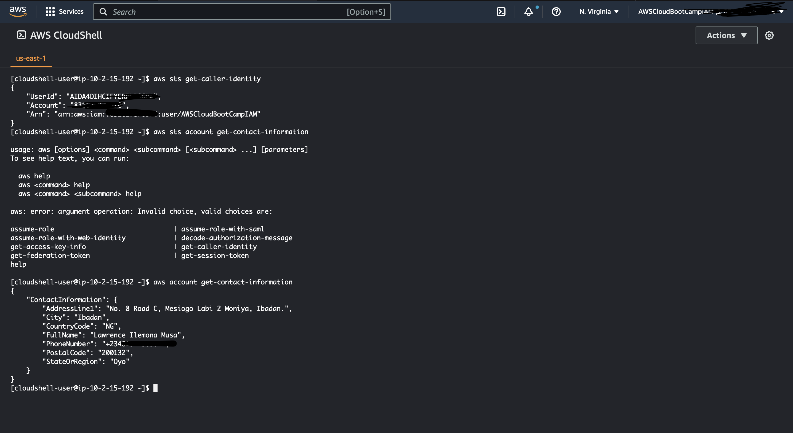


### Install AWS CLI
After launching this repo on Gitpod, I installed AWS CLI using the code below. Note: These steps can be found on the [AWS CLI website](https://docs.aws.amazon.com/cli/latest/userguide/getting-started-install.html).

```
$ curl "https://awscli.amazonaws.com/awscli-exe-linux-x86_64.zip" -o "awscliv2.zip"
$ unzip awscliv2.zip
$ sudo ./aws/install
```

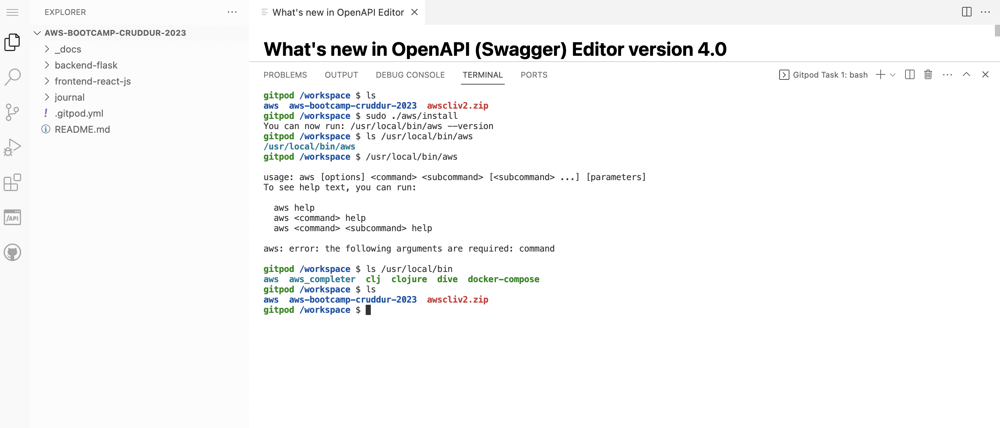


After installing the AWS CLI from the terminal, I configured Gitpod from the .gitpod.yml file with commmands that needs run when next the workspace is being spin up. What the code does is configure AWS CLI auto-prompt to partial mode, change the working directory to workspace and install AWS CLI.

```yaml
tasks:
  - name: aws-cli
    env:
      AWS_CLI_AUTO_PROMPT: on-partial
    init: |
      cd /workspace
      curl "https://awscli.amazonaws.com/awscli-exe-linux-x86_64.zip" -o "awscliv2.zip"
      unzip awscliv2.zip
      sudo ./aws/install
      cd $THEIA_WORKSPACE_ROOT
```

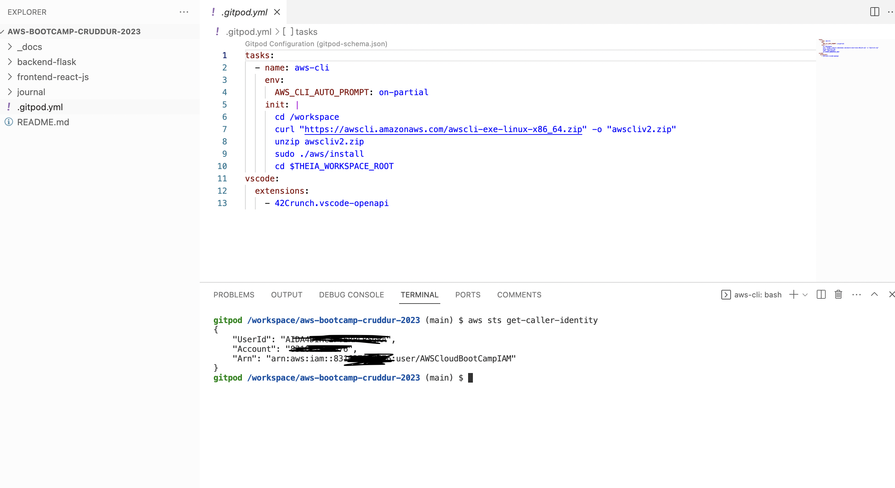


I also set AWS credentials / access keys for my workspace by running the code below in the Gitpod terminal to set environment variable. 
These variables are immediately available to the code space any other time its spinned up.

```
$ gp env AWS_ACCESS_KEY_ID="MY_ACCESS_KEY_ID"
gp env AWS_SECRET_ACCESS_KEY="MY_SECRET_ACCESS_KEY"
gp env AWS_DEFAULT_REGION="us-east-1"
```

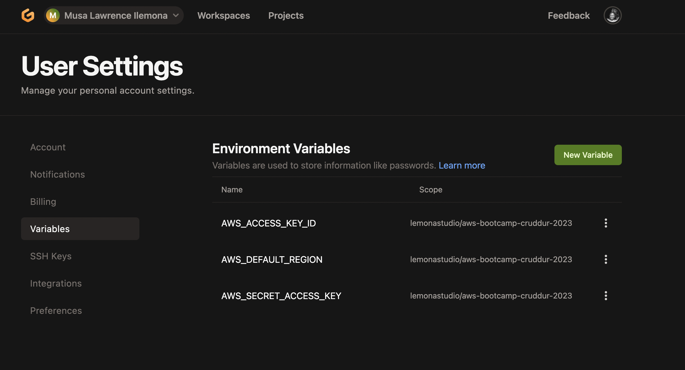


### Create a Billing Alarm
Here, I created a budget and a billing alarm from the CLI using GitPod. Instructions on how to create a budget with billing alarm from 
CLI can be found on the [AWS website here](https://awscli.amazonaws.com/v2/documentation/api/latest/reference/budgets/create-budget.html#examples).

#### Creating SNS Topic
To create a Billing Alarm we need to create a SNS topic that wil deliver us the alert when our spending is beyond our budget. Here's a 
[link](https://docs.aws.amazon.com/cli/latest/reference/sns/create-topic.html) to instructions on how to create an SNS topic from CLI on 
the AWS website.

*To create the SNS topic and get the topic's ARN:*

```
aws sns create-topic --name billing-alarm
```

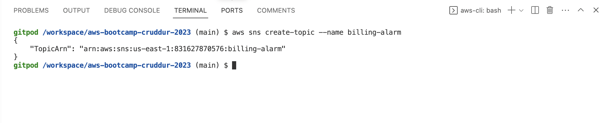

*To subscribe to the SNS topic created by supplying the topic ARN:*

```
aws sns subscribe \
    --topic-arn TopicARN \
    --protocol email \
    --notification-endpoint your@email.com
```

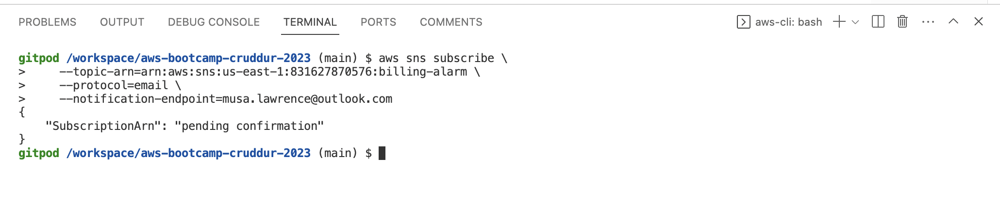


The SNS topic was subscribed to but it show Pending subscription. I went to the SNS topic dashboard and from there I could either confirm the 
subscription or request a subscription be sent to my email address and confirm the subscription via the link sent, I did the latter. 

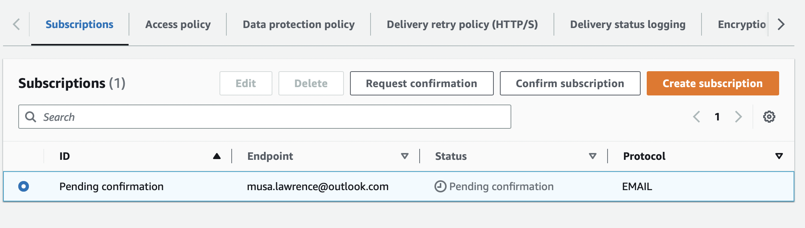

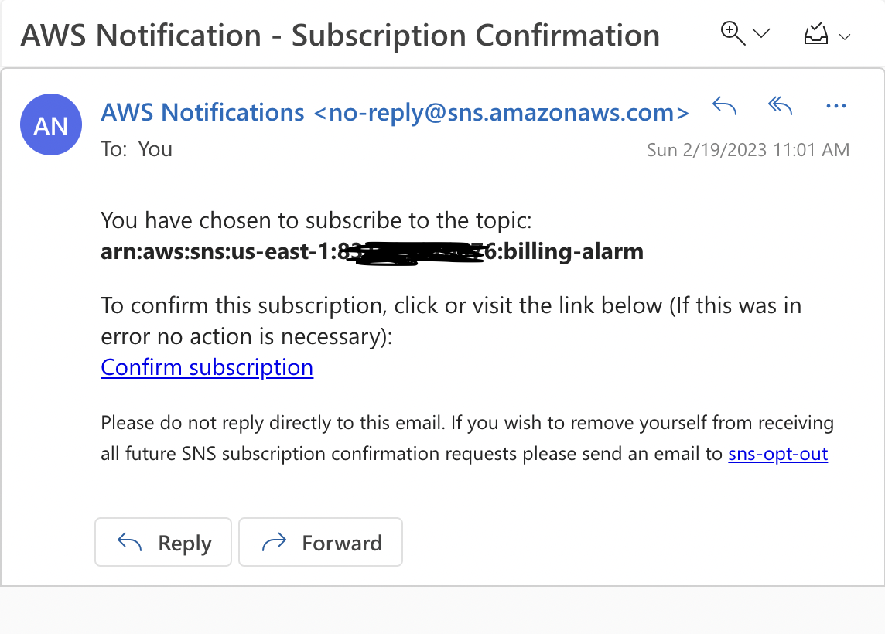

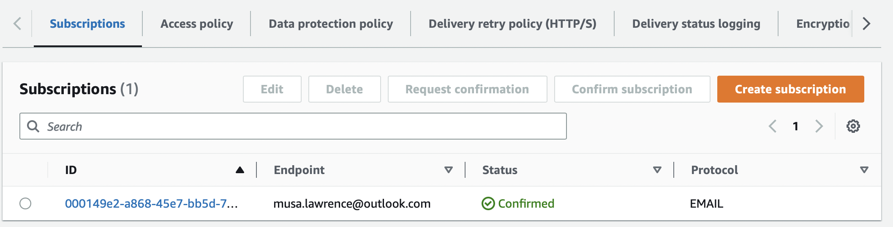

#### Creating Budget from CLI
I created a budget.json file which contains the requirement for the budget such as the budget limit, budget name, budget type etc. 
The JSON is as shown below.

```json
{
    "BudgetLimit": {
        "Amount": "5",
        "Unit": "USD"
    },
    "BudgetName": "BudgetFromCLI",
    "BudgetType": "COST",
    "CostFilters": {
        "TagKeyValue": [
            "user:Key$value1",
            "user:Key$value2"
        ]
    },
    "CostTypes": {
        "IncludeCredit": true,
        "IncludeDiscount": true,
        "IncludeOtherSubscription": true,
        "IncludeRecurring": true,
        "IncludeRefund": true,
        "IncludeSubscription": true,
        "IncludeSupport": true,
        "IncludeTax": true,
        "IncludeUpfront": true,
        "UseBlended": false
    },
    "TimePeriod": {
        "Start": 1477958399,
        "End": 3706473600
    },
    "TimeUnit": "MONTHLY"
}
```

Next, I added the budget's notifications-with-subscribers.json file which sets the configuration for the notification / billing alarm for 
the spending budget we created above. The notifications json file contains requirements for the notification such as the subscriber which 
is my email address and the subscriber type which here is EMAIL, the threshold for the notification, notification type etc.

```json
[
    {
        "Notification": {
            "ComparisonOperator": "GREATER_THAN",
            "NotificationType": "ACTUAL",
            "Threshold": 80,
            "ThresholdType": "PERCENTAGE"
        },
        "Subscribers": [
            {
                "Address": "musa.lawrence@outlook.com",
                "SubscriptionType": "EMAIL"
            }
        ]
    }
]
```
Now, to actually create the budget, below is a snippet of the code that I ran from the GitPod terminal to create the budget. The code explains 
itself, showing the AWS_ACCOUNT_ID (which was made available through the environment variables), the location of the budget.json file and the notification-with-subscribers.json file.

```
aws budgets create-budget \
    --account-id $AWS_ACCOUNT_ID \
    --budget file://aws/json/budget.json \
    --notifications-with-subscribers file://aws/json/budget-notifications-with-subscribers.json
```

*Screenshots images from the task*

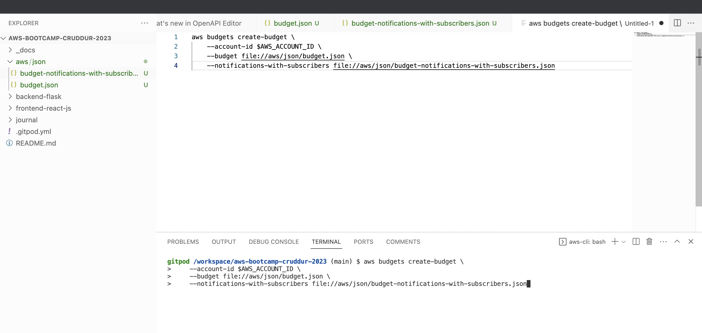

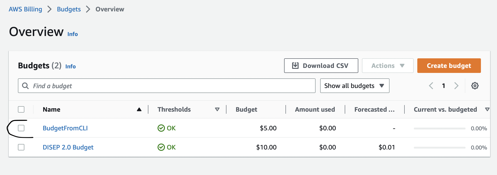

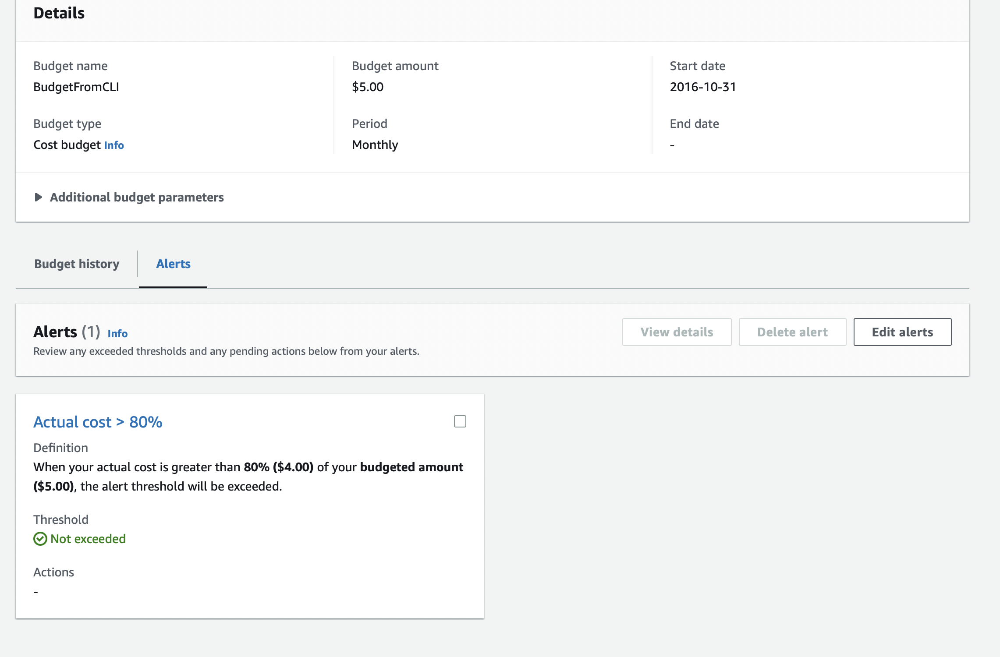


#### Creating the Billing Alarm
With AWS CloudWatch I created a billing alarm by making an alarm-config.json file in GitPod, which contains requirements such as the alarm name, description, alarm action (i.e the SNS topic ARN which will trigger the SNS to send a notification) etc.

```json
{
    "AlarmName": "DailyEstimatedCharges",
    "AlarmDescription": "This alarm would be triggered if the daily estimated charges exceeds 1$",
    "ActionsEnabled": true,
    "AlarmActions": [
        "arn:aws:sns:us-east-1:831627870576:billing-alarm"
    ],
    "EvaluationPeriods": 1,
    "DatapointsToAlarm": 1,
    "Threshold": 1,
    "ComparisonOperator": "GreaterThanOrEqualToThreshold",
    "TreatMissingData": "breaching",
    "Metrics": [{
        "Id": "m1",
        "MetricStat": {
            "Metric": {
                "Namespace": "AWS/Billing",
                "MetricName": "EstimatedCharges",
                "Dimensions": [{
                    "Name": "Currency",
                    "Value": "USD"
                }]
            },
            "Period": 86400,
            "Stat": "Maximum"
        },
        "ReturnData": false
    },
    {
        "Id": "e1",
        "Expression": "IF(RATE(m1)>0,RATE(m1)*86400,0)",
        "Label": "DailyEstimatedCharges",
        "ReturnData": true
    }]
}
```
From the terminal, the command to create the billing alarm is shown below. The command referenced the alarm_config.json file created above.

```
aws cloudwatch put-metric-alarm --cli-input-json file://aws/json/alarm-config.json
```


