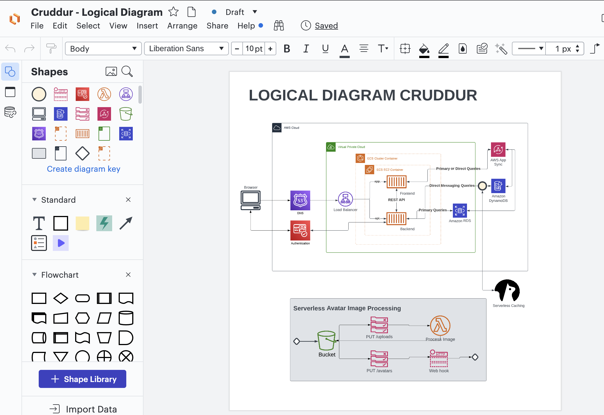
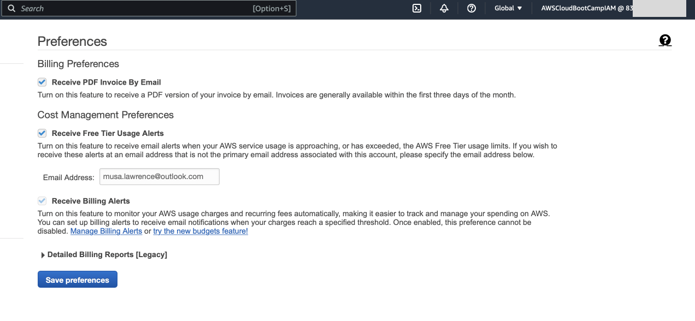
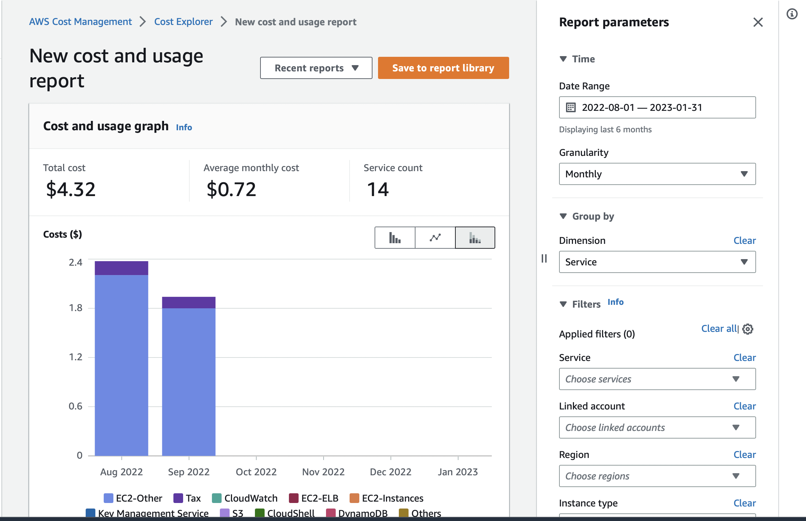
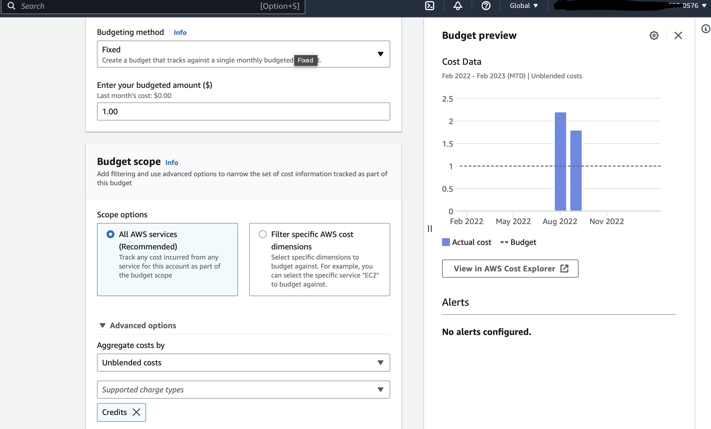
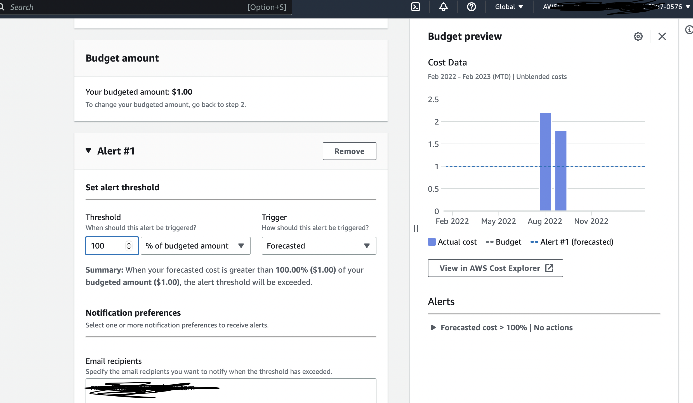

# Week 0 — Billing and Architecture

## Required Tasks

### Recreate Conceptual Diagram in Lucid Charts or on a Napkin

I recreated the conceptual diagram for the cruddur app. A conceptual diagram helps to define concepts and rules for a project and there's no technical aspect to it. Here's an image showing the conceptual diagram I recreated:

Conceptual Diagram: [View on Lucid](https://lucid.app/lucidchart/75c603ed-0af5-406f-9a48-b45606ba87a0/edit?viewport_loc=-387%2C-238%2C3968%2C2263%2C0_0&invitationId=inv_3fc1bff0-46f8-427e-b9eb-7e9c61da4289)

### Recreate Logical Architectual Diagram in Lucid Charts

I also recreated the logical diagram (i.e the blue print) for the cruddur app. The logical diagram defines how the system should be implemented, 
breaking the large conceptual diagram into functional logical blocks.

Logical Diagram: [View on Lucid](https://lucid.app/lucidchart/9f493397-c7dd-4bb1-bf5d-d8103beb5a64/edit?viewport_loc=-521%2C-73%2C3842%2C2191%2C0_0&invitationId=inv_18573649-5770-4a56-9a09-d01998f68b58)

### AWS Billing
From the Billing dashboard, on the billing preference page, I selected options to receive PDF version of my AWS invoice and also to receive 
free tier usage alerts and billing alerts via my email address. Also took a general overview of the billing dashaboard to know how to check 
cost incurred break down by service and all other billing related options on the dashboard. I also explored cost management on AWS using 
AWS Cost Explorer, which is a helpful service to get cost and usage reports of resources on your AWS account and alos good for auditing.

Billing Preference Page

AWS Cost Explore Page

### AWS Budgets
I created a new budget to track my credits spend. There was already a budget created in my AWS account to track monthly spend and it was set
to $10. This was created during a AWS course I attended for my AWS Developer Associate certification. The new budget was set to $1 and I added 
an email address where to be notified if this threshold is exceeded. AWS will automatically notify me when:

- My spending reaches 85% of my threshold
- My spending reaches 100% of my threshold
- When my forecasted spending reaches 100% of my threshold

