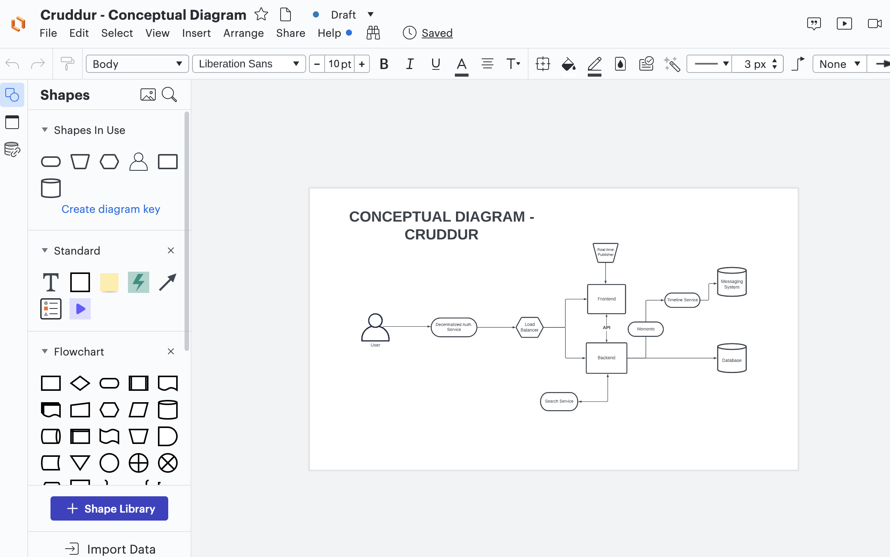

# Week 0 — Billing and Architecture

## Required Tasks

### Recreate Conceptual Diagram in Lucid Charts or on a Napkin

I recreated the conceptual diagram for the cruddur app. A conceptual diagram helps to define concepts and rules for a project and there's no technical aspect to it. Here's an image showing the conceptual diagram I recreated:

*Conceptual Diagram: [View on Lucid](https://lucid.app/lucidchart/75c603ed-0af5-406f-9a48-b45606ba87a0/edit?viewport_loc=-387%2C-238%2C3968%2C2263%2C0_0&invitationId=inv_3fc1bff0-46f8-427e-b9eb-7e9c61da4289)*

### Recreate Logical Architectual Diagram in Lucid Charts

I also recreated the logical diagram (i.e the blue print) for the cruddur app. The logical diagram defines how the system should be implemented, 
breaking the large conceptual diagram into functional logical blocks.

*Logical Diagram: [View on Lucid](https://lucid.app/lucidchart/9f493397-c7dd-4bb1-bf5d-d8103beb5a64/edit?viewport_loc=-521%2C-73%2C3842%2C2191%2C0_0&invitationId=inv_18573649-5770-4a56-9a09-d01998f68b58)*

### AWS Billing
From the Billing dashboard, on the billing preference page, I selected options to receive PDF version of my AWS invoice and also to receive 
free tier usage alerts and billing alerts via my email address. Also took a general overview of the billing dashaboard to know how to check 
cost incurred break down by service and all other billing related options on the dashboard. I also explored cost management on AWS using 
AWS Cost Explorer, which is a helpful service to get cost and usage reports of resources on your AWS account and alos good for auditing.

*Billing Preference Page*

*AWS Cost Explore Page*

### Create a Budget
I created a new budget to track my credits spend. There was already a budget created on my AWS account to track monthly spend and it was set
to $10. This was created during a course I attended for my AWS Developer Associate certification. The new budget was specifically created to 
track my credits spend even though I do not currently have any credits on my AWS account and the threshold was set to $1. I also created an 
alert for notification, which will be triggered when 100% forecasted spending equals the threshoald of 1%. As for the free tier, you can only 
create maximum of 2 budegts, additional budgets will incur cost.

*Images from the task:*

### Add MFA to Root account
I created my AWS account months before this bootcamp so I have already carried out the security recommendations required to secure my account. However, for this bootcamp I created a new IAM user and for which I have also set Multi-factor Authentication. MFA serves as another layer of security to protect our resources on AWS. The security recommendation from the attached screenshots have already been attended to and there are no affected policy but it wouldn't just disappear lol.

*Images from the task:*

